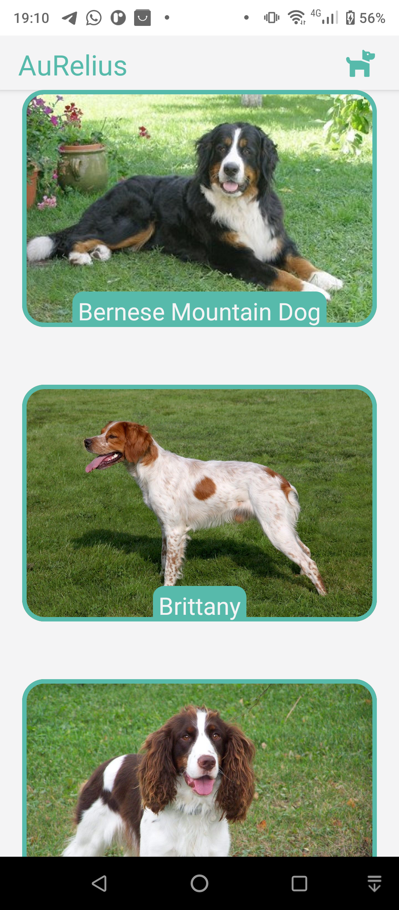
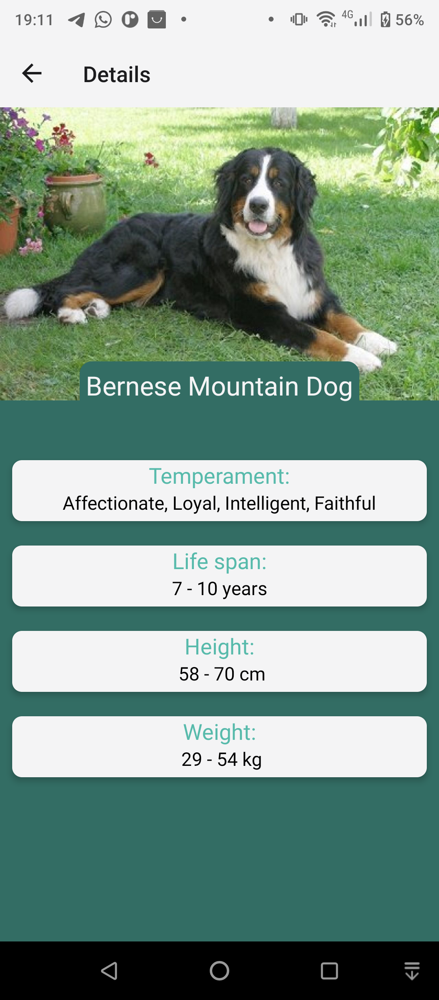

# 🐶 AuRelio

Este projeto foi criado para a disciplina **Desenvolvimento para dispositivos móveis** e se trata de um aplicativo que mostra um feed com imagens aleatórias de cachorros, que quando clicadas mostram mais detalhes sobre a raça do cachorro da foto.

## 📱 Screenshots

